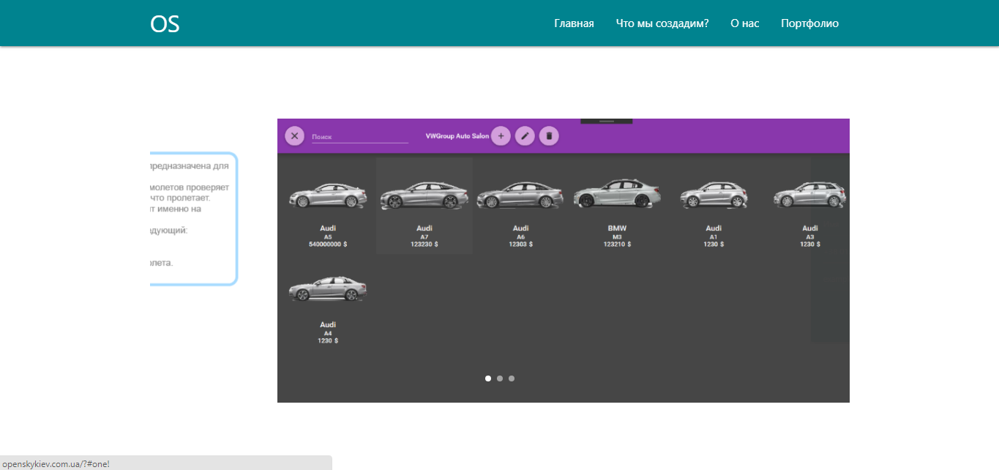
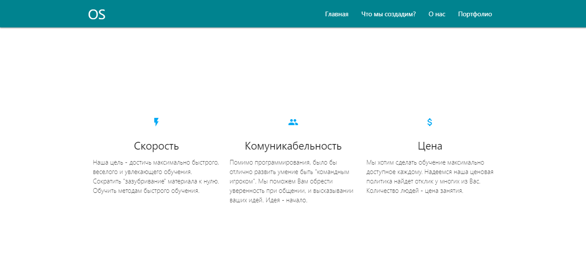
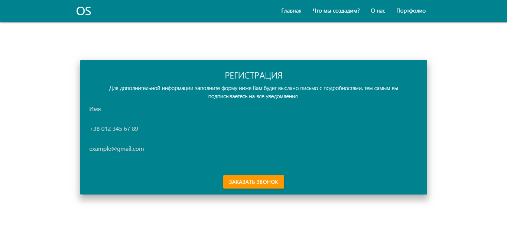

# Сайт курсов по программированию OpenSky.
>Сайт-визитка использует скроллинг по секциям при помощи fullpage.js.
>Для дизайна сайта используется библиотека Materializecss.
>Подписывает пользователей на уведомления, отправляет данные о пользователе администратору.
## Скриншоты:
### Главная:

### Слайдер:

### Подробная информация:

### Форма регистрации:

